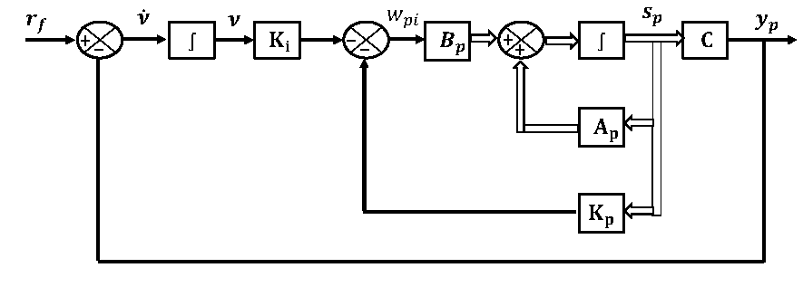
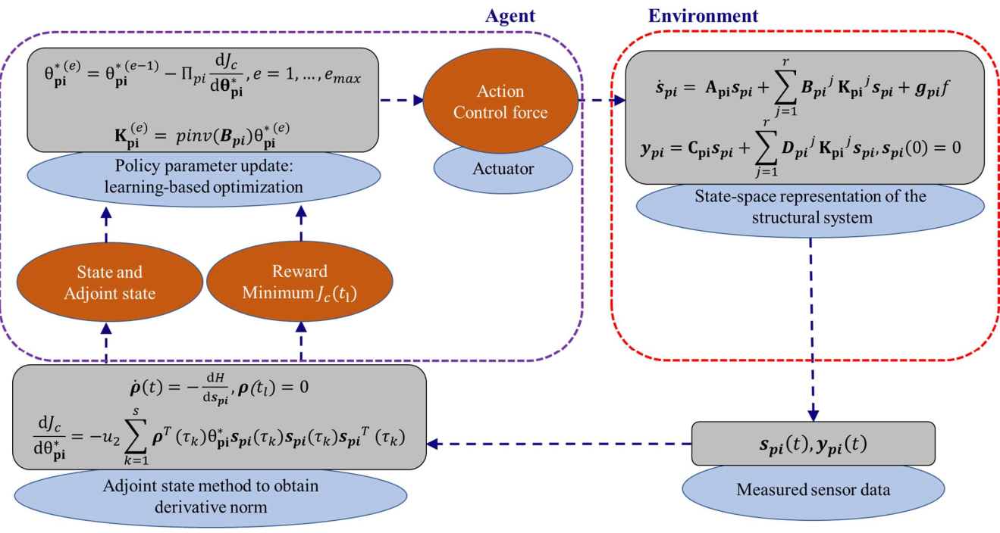

# Reinforcement-Learning-for-Active-Structural-Control
This repository contains the python codes of the paper 
  > + Panda, J., Chopra, M., Matsagar, V., & Chakraborty, S. (2023). An iterative gradient descent-based reinforcement learning policy for active control of structural vibrations. Computers & Structures, Accepted, in press. [Article]

# Signal flow diagram of closed loop structure-controller system in PI framework.  

# Detailed flow diagram showing the iterative sequence for policy parameter update.

